# Memories
# Link for website: https://dreamy-mirzakhani-e36ee3.netlify.app/posts
## Introduction

Using React, Node.js, Express & MongoDB, Full Stack MERN Application - from start to finish. The App is called "Memories" and it is a simple social media app that allows users to post interesting events that happened in their lives.

## Screenshots
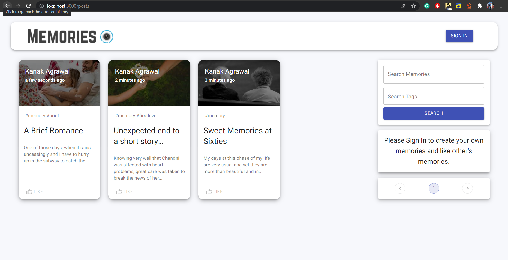
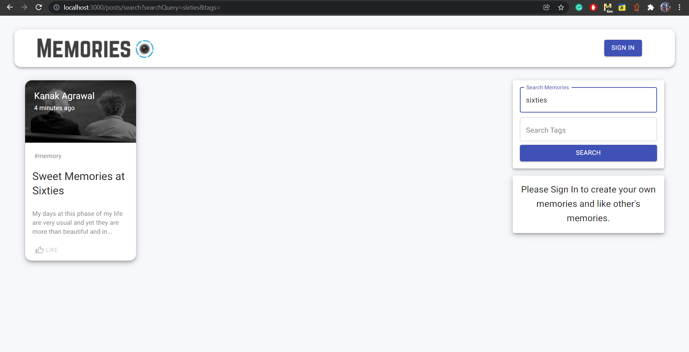
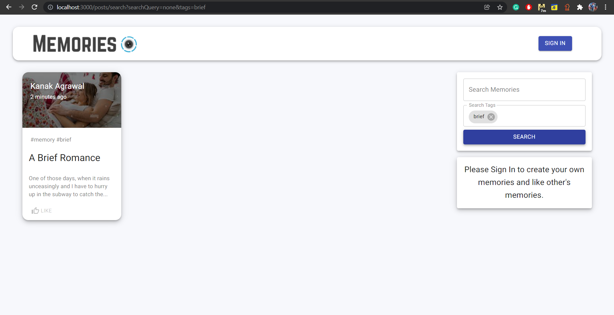
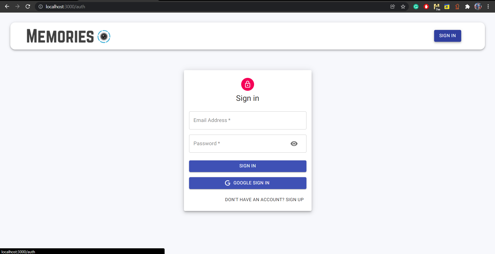
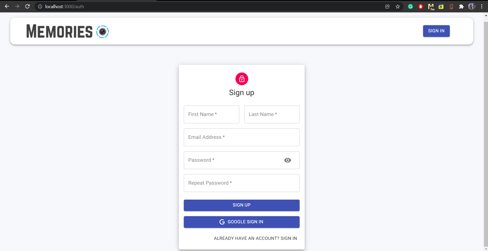
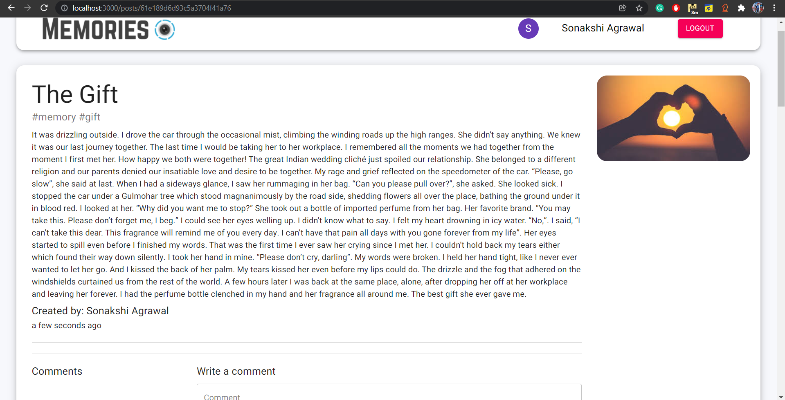
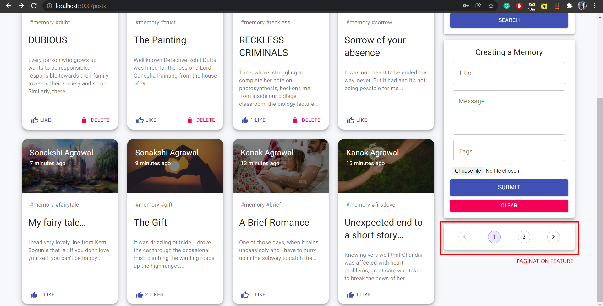
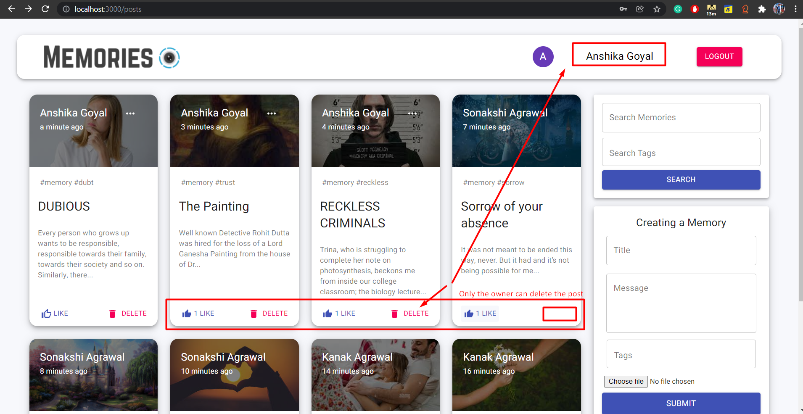
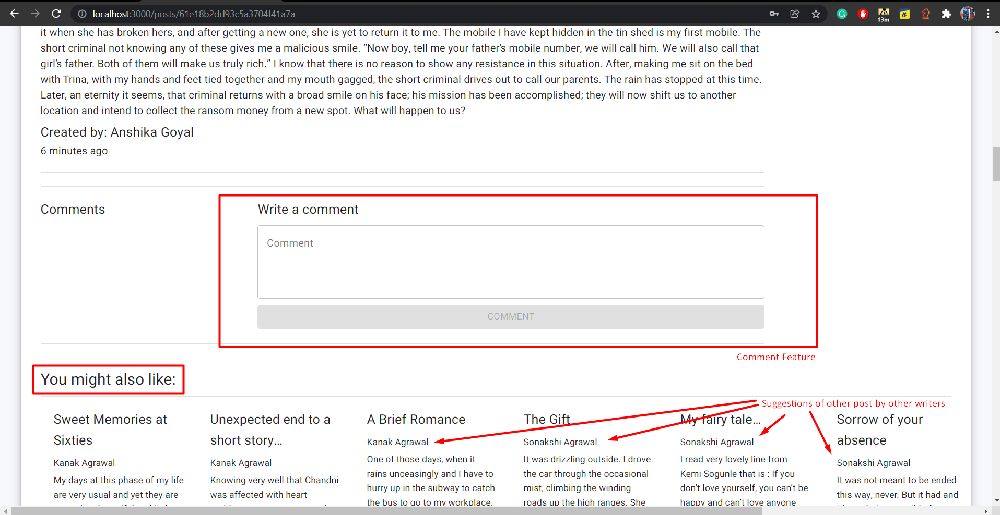
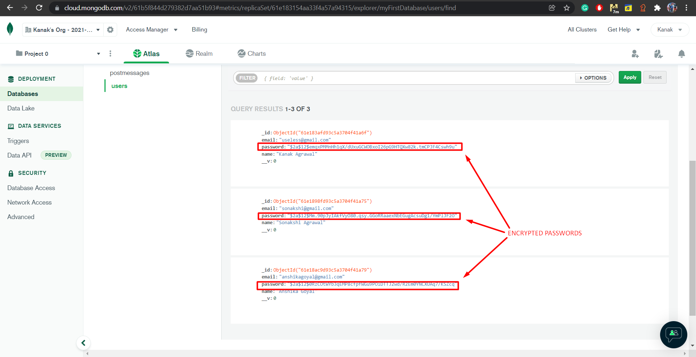
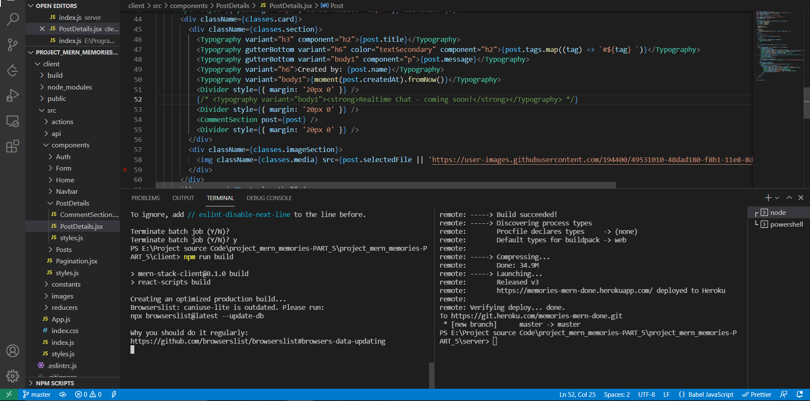
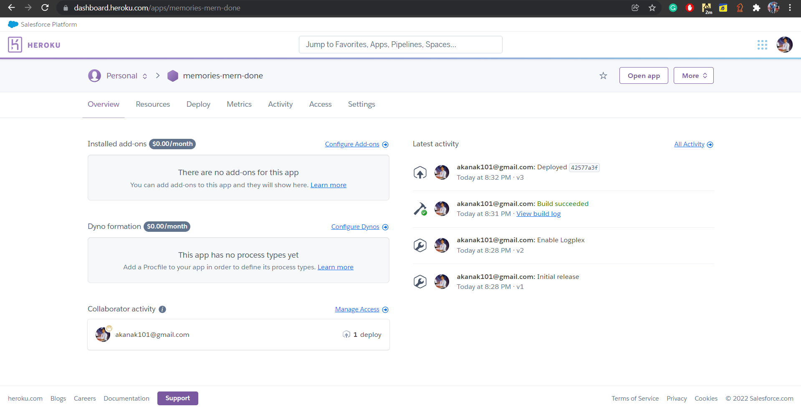
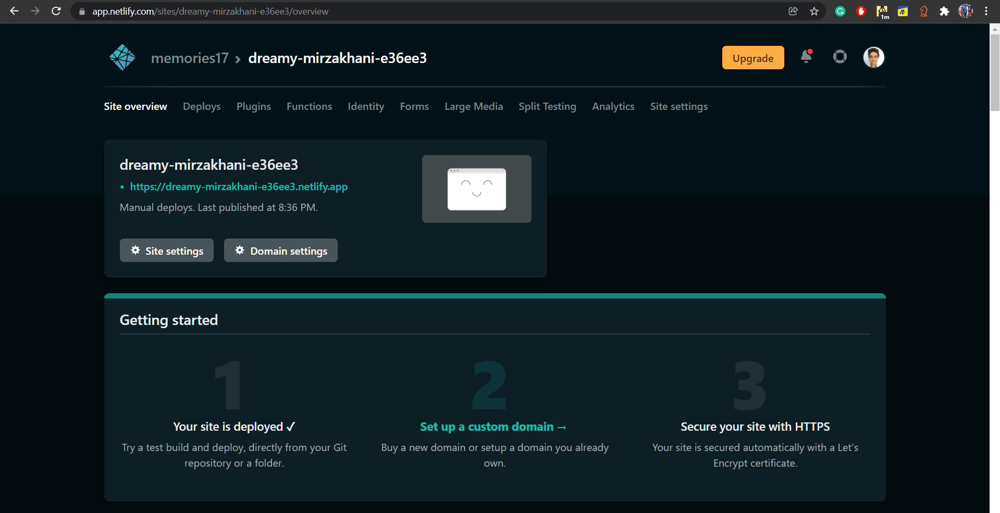


Setup:
- run ```npm i && npm start``` for both client and server side to start the app
